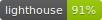

</img>

<h1 align="center">Multik</h1>
<h3 align="center">Gallery of projects and professional photo collection</h3>

  

---

<h2 align="center">Technologies</h2>

Project is created with:

<ul>
  <li>React: 16.13.0</li>
  <li>SASS: 4.13.1</li>
  <li>Bootstrap: 4.4.1</li>
  <li>Contentful: 7.14.3</li>
  <li>scrollmagic: 2.0.7</li>
  <li>react-gsap: 1.2.0</li>
</ul>

---

<h2 align="center"> Launch and Content</h2>

To launch this project, go to https://multik.netlify.app/

<h3 align="center"> Navigation on Main Page</h3>

Loading page waiting for a request from Contentful.

  

<h3 align="center">Navigation through the Project's pages</h3>

Added gallery with Grid layout as well as Photo Carousel for zoom in interesting photos, basic info about Collection.

  

<h3 align="center"> Animation with GSAP and ScrollMagic</h3>

Zoom in/out of centered photo and slide to the next category

  

<h3 align="center">Responsive Design</h3>

  

---

<h2> Support</h2>

Reach out to me at one of the following places!

Website at [Multik](https://multik.netlify.app/)

Twitter at [AndrewZ](https://twitter.com/AndrewZer)

LinkedIn at [Andrew Zernov](https://www.linkedin.com/in/andrei-zernov/)

---

<h2> License</h2>

MIT license 

Copyright 2020 © Artem Zuev

